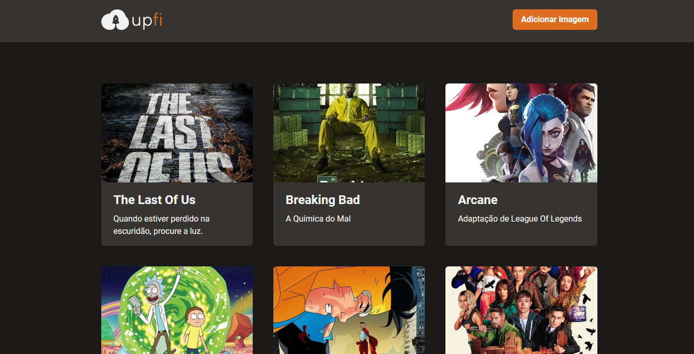

### 💻 Projeto
Upfi é uma aplicação para upload de imagens, desenvolvido como desafio do Chapter IV Bootcamp Ignite da Rocketseat.

### 🖼 Demonstração
<p>
   
</p>

### 🎲 Rodando a Aplicação

```bash
# Clone este repositório
$ git clone https://github.com/limaCoder/upfi-image-upload
# Instale as dependências
$ yarn ou npm
# Execute a aplicação
$ yarn ou npm dev
# Execute os testes
$ yarn test
```

### 🚀 Tecnologias

Esse projeto foi desenvolvido com as seguintes tecnologias:

- ReactJS
- Next.js
- Typescript

### 📕 Bibliotecas

Esse projeto foi utilizou das seguintes lib:

- react-hook-form
- react-query
- chakra-ui
- faunadb